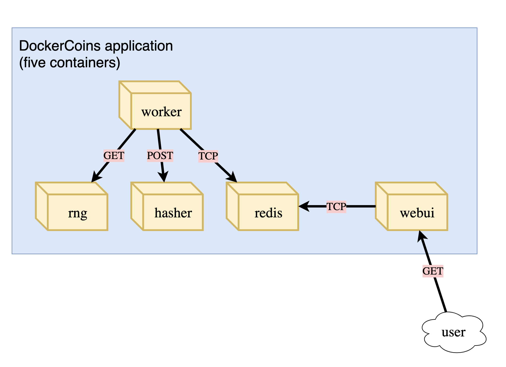

# Pods

In this module, we will run our application in a Kubernetes cluster.

You will learn about:

- How to create pod resources with YAML definitions
- How to view the Kubernetes events that occurred when creating the pod
- How to look at the application logs with kubectl or the Docker CLI
- How to access containers in a pod for troubleshooting purposes

## Start

In the start state, you are provided with the following Docker images:

- `rotcaus/dockercoins_webui`
- `rotcaus/dockercoins_rng`
- `rotcaus/dockercoins_hasher`

Run `cd exercise/` and follow the instructions below to get started!

## Create a pod

From the exercise folder, run the following command to create your first pod:

```bash
kubectl apply -f pod.yml
```


By applying a new YAML definition, `kubectl` has sent a request to the API server to submit your new pod. The API server then stored it in `etcd` and let the scheduler assign a node for the new pod.

Once a node is chosen, the kubelet component running on that node calls the local Docker daemon to:

- pull the specified Docker images
- run containers according to their Docker images

This pod comes with  5 containers:

  

The main attributes in the YAML definition of the pod are the  `Kind` and the list of containers in `spec.containers`:

```yaml
apiVersion: v1
kind: Pod
metadata:
  name: dockercoins
spec:
  containers:
  - name: rng
    image: rotcaus/dockercoins_rng:v1
    imagePullPolicy: Always
  - name: hasher
    image: rotcaus/dockercoins_hasher:v1
    imagePullPolicy: Always
  - name: webui
    image: rotcaus/dockercoins_webui:v1
    imagePullPolicy: Always
    ports:
    - containerPort: 80
  - name: worker
    image: rotcaus/dockercoins_worker:v1
    imagePullPolicy: Always
  - name: redis
    image: redis
```

### References

[Understanding Kubernetes Objects - Spec and Status](https://kubernetes.io/docs/concepts/overview/working-with-objects/kubernetes-objects/#object-spec-and-status)

## Show all events occurring in the pod

Use the `kubectl get pods` command to list the newly created pod.

The expected output is:

```bash
NAME          READY   STATUS    RESTARTS   AGE
dockercoins   5/5     Running   0          55s
```

The `READY` column reports `5/5` because our application runs 5 containers (a frontend, 3 backends and a redis store).

Use the `kubectl describe` command to list the statuses of all the containers creatd within the pod:

```console
kubectl describe pod dockercoins
```

This pod runs multiple containers, so the `Events` section will list a log of all the events associated to all the containers running within the pod.

Even if the pod is created, it is not necessarily running or healthy. A few different steps could fail:

- You might not have permission to deploy in that namespace, depending on your user role
- The cluster might not have permission to pull from the registry
- The image might not exist or might not be pulled successfully due to network issues
- The Docker CMD/ENTRYPOINT (main command executed when starting the container) might fail to execute
- etc.

These failure reasons are listed in the `Events` section of the `kubectl describe pod` command.

The output of the describe command also provides additional information:

- `Start Time`: the time the pod started
- `Labels`: additional key/value data associated with the pod
- `Status`: indicates if the pod is running, pending or has crashed
- `IP`: the internal IP of the pod in the node
- `Containers > Image` (e.g: k8s.gcr.io/kube-apiserver:v1.15.0): the Docker image used for the container
- `Containers > Port + Host`: these ports are the pod internal port to access this service as well as the host internal port to access the service from within the node
- `Containers > Command`: the Docker command as specified when creating the pod
- `Containers > Liveness`: the result of the health check specified when creating the pod

## Access the logs of a pod

To access the logs of the containers running in the pod, run this command:

```console
kubectl logs pod/dockercoins
```

Given this pod has more than one container, you will need to specify which container you want to get the logs from:

```console
kubectl logs pod/dockercoins [rng hasher webui worker redis]
```

The name of each container is defined in the pod YAML definition.

## Troubleshoot containers running in a pod

Just like `docker exec` allows you to access a running container, `kubectl exec` can be used to remotely execute commands one of the containers present in a given pod.

It's easy to abuse `exec` commands and it's not recommended to use it in general on Kubernetes cluster. This is because any action inside a container can modify its behavior from the expected state and lead to inconsistency.

Use it sparingly and ideally only to inspect containers for troubleshooting purposes.

As an example, you can use `kubectl exec` to get an interactive bash session into the first container in the pod:

```console
kubectl exec -it pod/dockercoins -- /bin/sh
```

Use Ctrl-D or type `exit` to close the terminal session opened inside the container.

If the pod has multiple containers, you will have to pass the name of the container in addition to the name of the pod:

```console
kubectl exec -it pod/dockercoins -c [rng hasher webui worker redis] -- /bin/sh
```

From here, you can execute any command, such as:

- examining the file system (eg: `ls /var/log/..`, `cat /my-app/web.config`)
- interacting with processes in the container (e.g: `ps aux` to list all the processes active)

Links:

- [Get a shell to a running container in a pod](https://kubernetes.io/docs/tasks/debug-application-cluster/get-shell-running-container/)

## Displaying logs from multiple containers (optional part)

If you want to get the logs of multiple containers in a pod, you might be interested in installing [stern](https://github.com/wercker/stern), a multi pod and container log tailing for Kubernetes. 

On MacOS, Stern can be installed with Homebrew (`brew install stern`). If you are running Windows, you'll need to download the .exe from <https://github.com/wercker/stern/releases>.

After installation, you can the following commands to get all the logs of all the `DockerCoins` pods:

```console
stern dockercoins
stern dockercoins --container rng --timestamps
```

## Delete a pod

Finish the exercise by deleting the pod that we have created previously:

```bash
kubectl delete -f pod.yml
```
